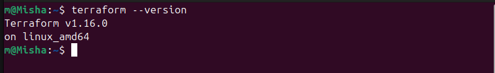
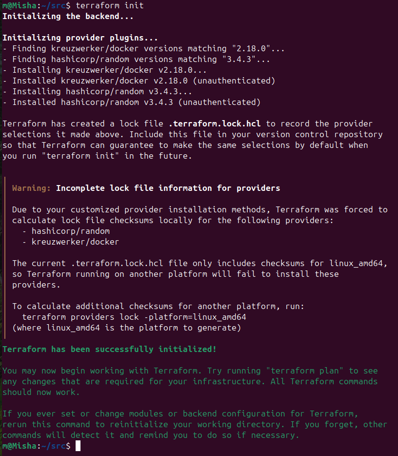
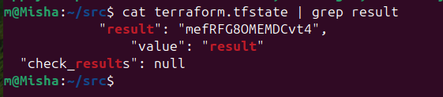
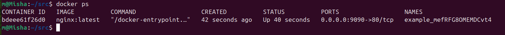
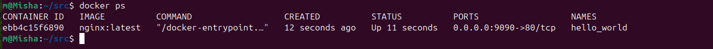
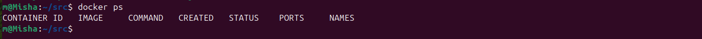

## Результаты выполнения лабораторной

### 1. Инициализация и применение конфигурации

`terraform init` прошёл успешно с использованием локального зеркала провайдеров (`~/tf-mirror`).  
Сгенерированный пароль: `mefRFG8OMEMDCvt4` (получен из `random_password.random_string.result`).

### 2. Запуск контейнера

После раскомментирования и исправления ошибок был создан контейнер на базе образа `nginx:latest`.  
Проброс портов: внешний `9090` → внутренний `80`.

| Параметр | Значение |
| --- | --- |
| Имя ресурса | `docker_container.nginx` |
| Имя контейнера (после исправления) | `hello_world` |
| Образ | `nginx:latest` |
| `keep_locally` | `true` |

### 3. Ответы на вопросы

Ответ на вопрос №2: 
Ответ: файл personal.auto.tfvars.

Этот файл явно указан в .gitignore и не попадает под общие шаблоны исключений (.terraform/*, *.tfstate). Именно в нём допустимо сохранять личную секретную информацию — логины, пароли, ключи, токены.

Terraform автоматически загружает переменные из всех файлов с суффиксом .auto.tfvars, поэтому значения из personal.auto.tfvars подхватываются без явного указания флага -var-file. Поскольку файл исключён из Git, секреты не попадут в репозиторий.

Ответ на вопрос №4: 
Ответ: после раскомментирования блока (строки 29–42) и выполнения terraform validate Terraform сообщает о следующих намеренно допущенных ошибках.
Ошибка 1: отсутствует имя (label) у ресурса docker_image

Исходный код:
`
resource "docker_image" {
  name         = "nginx:latest"
  keep_locally = true
}
`
Объяснение: объявление ресурса в Terraform требует два строковых аргумента — тип и имя (label). Без имени Terraform не может создать ссылку на ресурс (docker_image.nginx).

Исправление:

resource "docker_image" "nginx" {
  name         = "nginx:latest"
  keep_locally = true
}

Ошибка 2: имя ресурса docker_container начинается с цифры

Исходный код:

resource "docker_container" "1nginx" {

Объяснение: имена ресурсов в Terraform должны начинаться с буквы или символа подчёркивания. Имя 1nginx нарушает это правило.

Исправление:

resource "docker_container" "nginx" {

Ошибка 3: неверная ссылка на результат random_password

Исходный код:

name = "example_${random_password.random_string_FAKE.resulT}"

Объяснение: две ошибки в одной ссылке:

    ресурс объявлен как random_password "random_string", а не random_string_FAKE;
    атрибут называется result (в нижнем регистре), а не resulT.

Исправление:

name = "example_${random_password.random_string.result}"

Дополнительно: атрибут image_id недоступен в версии 2.18.0

Исходный код:

image = docker_image.nginx.image_id

Объяснение: в версии провайдера kreuzwerker/docker 2.18.0 у ресурса docker_image нет экспортируемого атрибута image_id — Terraform выдаёт ошибку Unsupported attribute. Атрибут image_id появился в более поздних версиях провайдера (начиная с 2.21.0).

Исправление: указать имя образа напрямую:

image = "nginx:latest"

Исправленный фрагмент кода

resource "docker_image" "nginx" {
  name         = "nginx:latest"
  keep_locally = true
}

resource "docker_container" "nginx" {
  image = "nginx:latest"
  name  = "example_${random_password.random_string.result}"

  ports {
    internal = 80
    external = 9090
  }
}

